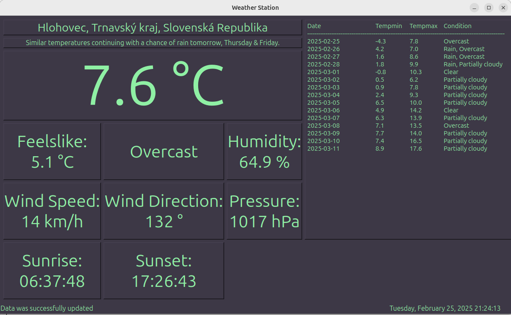

# Weather Station
---
A small, simple application that displays the current weather.
created in the Qt Creator development environment.
The current data is obtained from the url API in JSON format.

I implemented threading (QThread) to update the data 
every 60 seconds and the current datetime every second.

---

